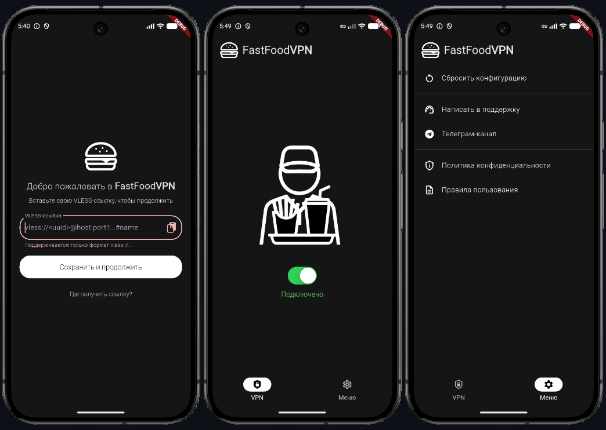

# FastFoodVPN (Flutter)

Небольшое Android-приложение на **Flutter/Dart**: ввод VLESS-ссылки, сохранение конфигурации и управление подключением через нативный слой (MethodChannel).

> Репозиторий приватный. Доступ могу предоставить по запросу (для отбора/ревью) или ссылку на APK файл находящийся в Google диск.

## Возможности
- ✅ Экран первичной настройки: ввод **VLESS-ссылки**
- ✅ Валидация формата VLESS (UUID / host / port / параметры)
- ✅ Нормализация ссылки (приведение параметров к единому виду)
- ✅ Безопасное хранение конфигурации в **flutter_secure_storage**
- ✅ Управление туннелем: **Start / Stop / Status**
- ✅ Экран настроек: сброс конфигурации и повторный ввод
- ✅ Восстановление статуса при запуске приложения

## Скриншоты

## Технологии
- Flutter / Dart
- MethodChannel (`fastfoodvpn/v2ray`) — взаимодействие с нативным кодом
- `flutter_secure_storage` — хранение VLESS-ключа

## Архитектура (кратка)
- `main.dart` → запуск приложения
- `app.dart` → тема + роутинг, обёртка `AccessKeyGate`
- `AccessKeyGate` → проверяет, сохранён ли ключ:
  - если ключа нет → показывает `StartPage`
  - если ключ есть → показывает основное приложение
- `StartPage` → вставка/ввод VLESS, валидация, сохранение
- `AccessKeyStore` → чтение/запись/удаление ключа в secure storage
- `VlessLink` → парсер VLESS и метод нормализации
- `V2rayService` → сервис-обёртка над MethodChannel: `startTunnel/stopTunnel/getStatus`
- `MainPage` → основной экран с переключателем подключения
- `SettingsPage` → сброс конфигурации
